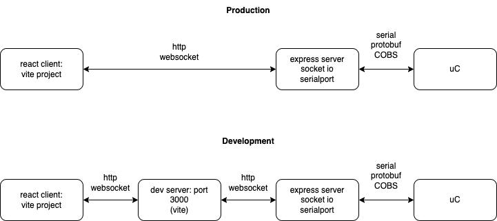

Vite + React, Javascript + SWC (Speed Web Compiler) 

Created using https://vitejs.dev/guide/

`$ npm create vite@latest`

Idea is to create this app, then wrap into electron following this appraoch. https://samdecrock.medium.com/building-electron-js-apps-with-react-js-2022-4d14fb2924ac. 

Uses the following tutorial to set-up node.js rs232:websocket bridge as a server.
https://www.youtube.com/watch?v=PPjpHaLkV7A&ab_channel=NathanKrasney
https://github.com/NathanKr/react-vite-express-setup

must run
`npm install -g nodemon # or using yarn: yarn global add nodemon`
to use nodemon

Test the connection to the server:
`curl "http://localhost:3000/socket.io/?EIO=4&transport=polling"`
expect response something like
`0{"sid":"6VhOGOFN4VR1Zu_dAAD2","upgrades":["websocket"],"pingInterval":25000,"pingTimeout":20000,"maxPayload":1000000}`

run using `npm start` in the portal folder. 
Runs vite / nodemon / concurrently
head to http://localhost:5173/ to view the react client gui
head to http://localhost:3000/ to see that the server is running